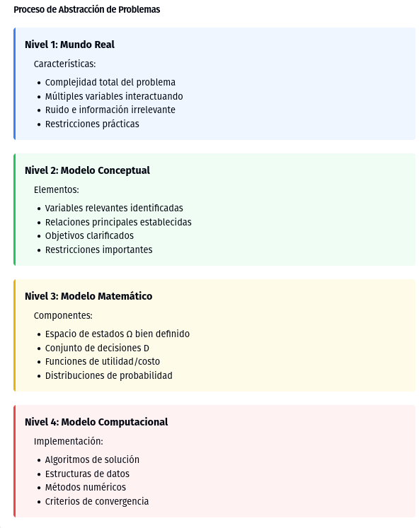
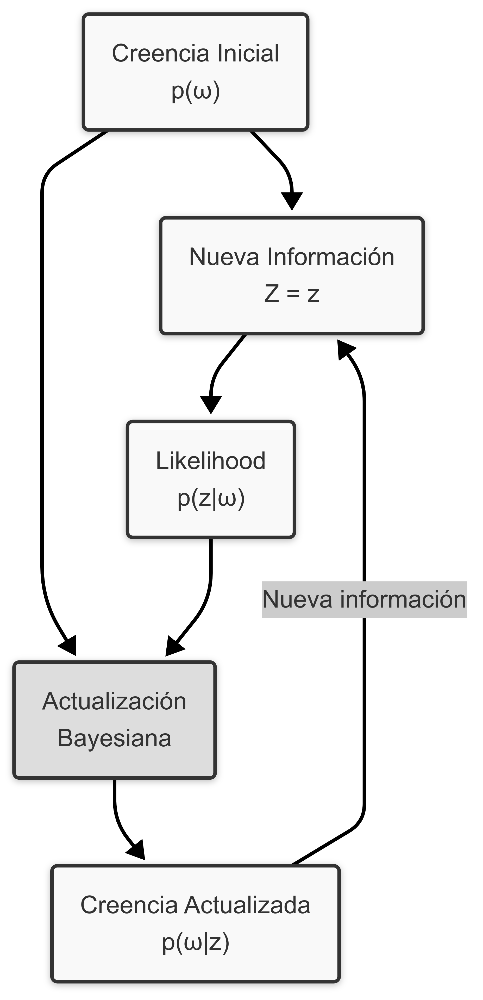
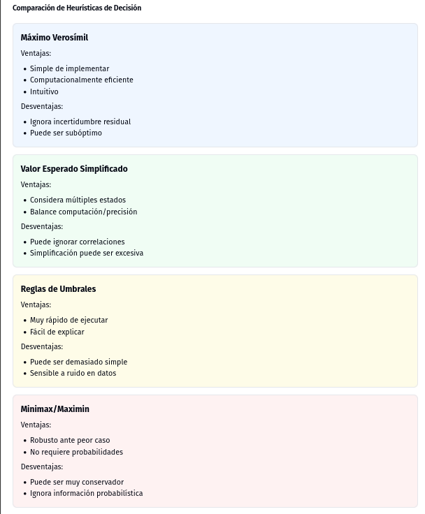

# Introducción teórico-matemática a los problemas de decisión estática bajo incertidumbre

Este documento presenta una **introducción formal** a la formulación y análisis de **problemas de decisión estática bajo incertidumbre**. Su objetivo es exponer los elementos esenciales — definiciones, ecuaciones y enfoques heurísticos — que permiten mapear un problema real a este marco teórico, proporcionando también la **intuición** necesaria para su aplicación práctica.

La exposición se asume para lectores con base en teoría de la probabilidad y teoría de la decisión, pero que necesiten un **recorrido conceptual** que integre los componentes clave de la **incertidumbre**, la **información parcial** (o "proxy") y el **razonamiento heurístico**.

---

## 1. Fundamentos de los problemas de decisión bajo incertidumbre

### 1.1 Definición básica

En un **problema de decisión estática** bajo incertidumbre, un **decisor** (o **agente**) debe **elegir** una acción (o un conjunto de acciones) **antes** de conocer con certeza el estado del mundo que afectará el resultado. Formulemos estos elementos:

- $\Omega$: **Espacio de estados** o **estados de la naturaleza**. Cada $\omega \in \Omega$ representa una configuración posible del mundo.  
- $D$: **Espacio de decisiones**. Cada $d \in D$ es una acción o estrategia completa que el agente puede tomar.  
- $\mathcal{X}(\omega, d)$: **Resultado** (o **outcome**) resultante de la decisión $d$ cuando el estado del mundo es $\omega$. A veces se modela como un **pago/beneficio** (o "payoff"), otras veces como un **costo** o **utilidad**.

El decisor generalmente no sabe **a priori** cuál es $\omega$, pero dispone de un **modelo probabilístico** $p(\omega)$ que indica la probabilidad (o densidad) de cada estado. Suponemos que:

$
\sum_{\omega \in \Omega} p(\omega) = 1
$

(o la integral se iguala a 1, en el caso continuo).

### 1.2 Función de utilidad o métricas de evaluación

Para evaluar las decisiones, suele usarse una **función de utilidad** $U(\omega, d)$ o, alternativamente, una **función de pérdidas** o **ganancias**. En muchos casos, se define:

$
U(\omega, d) = u\bigl(\mathcal{X}(\omega, d)\bigr)
$

donde $u$ es una transformación (posiblemente el "valor monetario" o alguna función de preferencia).

#### Valor esperado de la utilidad

En la teoría de la decisión clásica, el decisor busca **maximizar** (o minimizar) la **esperanza** de su utilidad (o costo). Así, el **criterio de Valor Esperado (VE)** se expresa como:

$
\mathbb{E}[U(d)] = \sum_{\omega \in \Omega} p(\omega)U(\omega, d)
$

(En caso continuo, se reemplaza la suma por la integral respectiva). La **decisión óptima** se define como:

$
d^* = \arg\max_{d \in D} \mathbb{E}[U(d)]
$

### 1.3 Decisión estática vs. dinámica

- **Estática**: El agente escoge su acción completa **antes** de observar la realización de $\omega$. (La información disponible antes de la decisión es la misma para todo el horizonte del problema).  
- **Dinámica**: Existen decisiones secuenciales, donde el agente puede ir actualizando su información y tomando nuevas decisiones sobre la marcha.

En este documento, nos centraremos en el **caso estático**.

---

## 2. Incertidumbre e información parcial

En muchos problemas, el decisor no observa $\omega$ **directamente**, sino que recibe **información parcial**, a menudo ruidosa o incompleta, acerca del verdadero estado. Llamemos a esta información un **"proxy"** o un **vector de observaciones** $Z$.

### 2.1 Variables aleatorias y distribución condicional

Sea $Z$ una variable (o conjunto de variables) aleatoria(s) con la distribución $p(z \mid \omega)$. Al obtener el valor observado $z$, el decisor puede actualizar su creencia sobre $\omega$ usando la **regla de Bayes**:

$
p(\omega \mid z) = \frac{p(z \mid \omega)p(\omega)}{\sum_{\omega' \in \Omega} p(z \mid \omega')p(\omega')}
$

En muchos problemas prácticos, **no** se dispone de $p(z \mid \omega)$ exacta, sino que se recurre a **estimaciones**, **modelos simplificados** o **correlaciones empíricas**.

 
### 2.2 Formulación de un problema con información parcial

El decisor recibe $Z = z$ y luego **selecciona** $d$. En la versión **estática** pura, puede ocurrir que:
- El decisor **no pueda** observar $z$ en el momento de decidir (o lo observa pero la acción no puede cambiar).  
- O bien el decisor observa $z$ y, **sin más interacciones posteriores**, elige $d$.

En cualquier caso, la **estrategia** puede definirse como una función $\delta$ que asocia cada valor posible de $z$ a una decisión $\delta(z)$. Esta visión se generaliza fácilmente al marco de la decisión estática con "observaciones previas".

---

## 3. Mapeo de problemas reales a esta formulación

Para "ver" un problema real como un **problema de decisión estática** bajo incertidumbre:

1. **Identificar las decisiones** ($D$): ¿Qué conjunto de acciones estratégicas se tienen disponibles?  
2. **Modelar el estado de la naturaleza** ($\Omega$): ¿Cuáles son las circunstancias exógenas (incertidumbre) relevantes?  
3. **Definir la función de utilidad (o costo)**: ¿Cómo valorar cada outcome? ¿Cuáles criterios se priorizan (tiempo, riesgo, costos, etc.)?  
4. **Establecer el modelo probabilístico**:
   - ¿Cómo se distribuyen los estados $\omega$?
   - ¿Qué información parcial/proxy existe (variables $Z$)?
   - ¿Cómo se relaciona $Z$ con $\omega$? (p.ej. $p(z \mid \omega)$ estimado o supuesto).
5. **Evaluar** las posibles decisiones con la esperanza de la utilidad o un criterio multicriterio.
---

## 4. Heurísticas y enfoques aproximados

En muchas situaciones reales, la complejidad hace que sea **impracticable** obtener la solución óptima bajo el criterio de valor esperado de utilidad. Además, los datos disponibles para estimar $p(\omega)$ o $p(z \mid \omega)$ pueden ser **muy limitados** o ruidosos
. En estos casos, se utilizan **heurísticas** o **reglas de dedo** que aproximan el proceso de decisión.

### 4.1 Heurísticas de elección de decisión

1. **Máximo verosímil** ("most likely state"):  
   - Estimar cuál $\omega$ es más probable dado $Z=z$ y tomar la decisión óptima suponiendo que ese es el estado real.  
   $
   \omega_{\text{ML}}(z) = \arg\max_{\omega} p(\omega \mid z)
   $
   - Limitación: ignora la incertidumbre residual sobre el resto de estados.

2. **Valor Esperado Simplificado**:  
   - Asumir que las posibles divergencias de $\omega$ respecto a la más probable son poco relevantes, y calcular la utilidad esperada de forma agregada pero con un modelo simplificado (tal vez ignorando correlaciones).

3. **Reglas de umbrales**:  
   - Basadas en correlaciones directas entre $Z$ y ciertos outcomes, estableciendo que si $z$ supera un cierto umbral (o combina ciertos valores), entonces se elige $d_A$; de lo contrario, se elige $d_B$.

4. **Minimax** o **Maximin**:  
   - Seleccionar $d$ que **maximice** la utilidad mínima posible (o minimice el máximo costo). Se ignoran probabilidades, priorizando robustez ante un "peor caso" plausible.

### 4.2 Heurísticas de inferencia con datos escasos

- **Frecuencias empíricas**: Usar conteos y correlaciones directas a partir de datos limitados:  
  $
  \hat{p}(\omega \mid z) \approx \frac{\text{\# de observaciones con }(\omega, z)}{\text{\# total de observaciones con }z}
  $
- **Suavizado (smoothing)**: Añadir pseudo-cuentas (Dirichlet, Laplace) para evitar probabilidades nulas en muestras pequeñas.  
- **Expert-based**: Incorporar conocimiento experto o "best guesses" cuando los datos son insuficientes.

---

## 5. Proceso sistemático de diseño de un problema de decisión estática

Cuando enfrentamos un **problema real** y queremos **diseñar** (o "mapear") un modelo de decisión estática bajo incertidumbre:

1. **Recolección de información**:  
   - Identificar las **variables de interés** (incertidumbre principal).  
   - Determinar **qué observaciones** o "proxy" pueden estar disponibles.  
   - Definir los **factores** que determinan la **utilidad** o **pérdida**.

2. **Abstracción y simplificación**:  
   - Delimitar un conjunto **manejable** de **estados** $\Omega$.  
   - Establecer el conjunto de **decisiones** realistas $D$.  
   - Reducir la complejidad de $p(\omega)$ y $p(z \mid \omega)$ con suposiciones (e.g. independencia, distribuciones paramétricas, etc.).

3. **Formulación matemática**:  
   - Especificar la **función de utilidad** $U(\omega, d)$ o un **vector de métricas** si es un problema multicriterio.  
   - Incorporar la **probabilidad** $p(\omega \mid z)$ si la acción puede depender de $z$.

4. **Búsqueda de la solución**:  
   - Aplicar el **criterio** de decisión apropiado (valor esperado, maximin, etc.).  
   - Emplear **heurísticas** cuando el espacio de decisiones o la estimación de probabilidades sea muy grande o incierta.

5. **Validación y ajuste**:  
   - Verificar si el modelo se ajusta a la realidad o si las simplificaciones resultan en decisiones poco robustas.  
   - Iterar si es posible.

---

## 6. Ejemplo ilustrativo (genérico)

Para hacer más concreto el proceso, supongamos un escenario **abstracto**:

- **Decisiones**: $D = \{d_1, d_2, d_3\}$.  
- **Estados**: $\Omega = \{\omega_1, \omega_2, \omega_3\}$.  
- **Utilidad**:
  $
  U(\omega_i, d_j) = u_{ij}
  \quad\text{para } i,j \in \{1,2,3\}
  $
- **Distribución a priori**: $p(\omega_1) = 0.4,\; p(\omega_2) = 0.3,\; p(\omega_3)=0.3$

Supongamos, además, un **proxy** $Z$ que puede tomar valores $\{z_a, z_b\}$. La regla bayesiana (o un modelo heurístico) nos permite estimar:
$
p(\omega_i \mid z_a), 
\quad 
p(\omega_i \mid z_b)
$

El decisor, una vez observa $Z=z_a$, elige $d^*(z_a)$. Similarmente para $z_b$. Se evalúa la utilidad esperada:

$
\mathbb{E}[U(d \mid z_a)] = \sum_{i=1}^3 p(\omega_i \mid z_a)U(\omega_i, d)
$

Si la decisión **depende** de $Z$, definimos una **política** $\delta$ tal que:
$
\delta(z_a) = d_j,\quad 
\delta(z_b) = d_k
$

La **utilidad esperada global** de la política $\delta$ (antes de observar $Z$) se calcula ponderando la probabilidad de cada valor de $Z$:
$
\mathbb{E}[U(\delta)] = \sum_{z \in \{z_a, z_b\}} p(z)\Bigl[\sum_{i=1}^3 p(\omega_i \mid z)U\bigl(\omega_i, \delta(z)\bigr)\Bigr]
$

La **política óptima** $\delta^*$ sería la que maximiza esta esperanza.

---

## 7. Conclusiones y perspectivas

La **toma de decisiones estática bajo incertidumbre** es un marco fundamental para modelar y **resolver** problemas donde:

1. El decisor **no** puede cambiar su acción tras observar la realización de $\omega$ (o bien no tiene un proceso iterativo).
2. Existen datos o información incompleta (proxy) que se pueden utilizar para **inferir probabilidades** sobre los estados.
3. La incertidumbre se gestiona usando una combinación de **teoría de la probabilidad** (idealmente Bayes) y **heurísticas** (cuando el modelo es complejo o los datos son escasos).

La clave está en la **abstracción** adecuada del problema:  
- Definir con cuidado la **utilidad** o las **métricas** que valoran el outcome.  
- Entender cómo las **observaciones** (proxy) se relacionan con la **incertidumbre** (estados).  
- Emplear métodos de **optimización** basados en el **valor esperado** o criterios alternos (p.ej. maximin) según la preferencia de riesgo.
- Incorporar **heurísticas** cuando sea difícil o costoso computar la solución exacta o ajustar un modelo probabilístico complejo.

Este tipo de abordaje es agnóstico a la naturaleza específica del problema (podría tratarse de logística, ingeniería, gestión de riesgos, etc.), siempre que podamos identificar los estados inciertos, las decisiones, la información parcial y la manera de valorarlas. Con esta guía, el lector puede reconocer la estructura subyacente en problemas reales y traducirlos a un problema de decisión estática bajo incertidumbre, para luego aplicar las herramientas y heurísticas aquí descritas.

---
## Bibliografia
Raiffa, H. & Schlaifer, R. (1961). Applied Statistical Decision Theory.
Berger, J. O. (1985). Statistical Decision Theory and Bayesian Analysis.
Keeney, R. L. & Raiffa, H. (1976). Decisions with Multiple Objectives: Preferences and Value Trade-offs